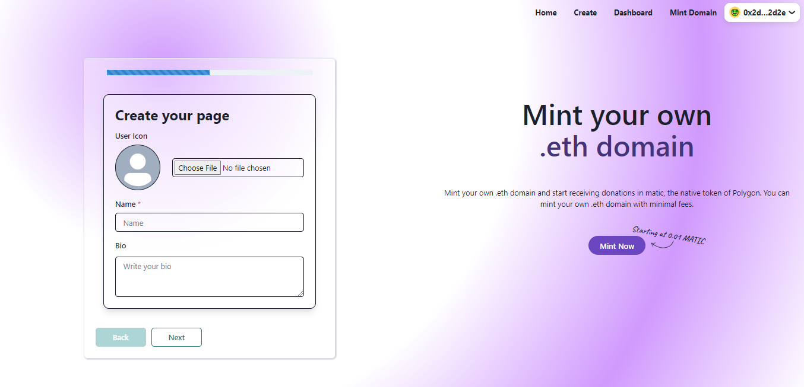
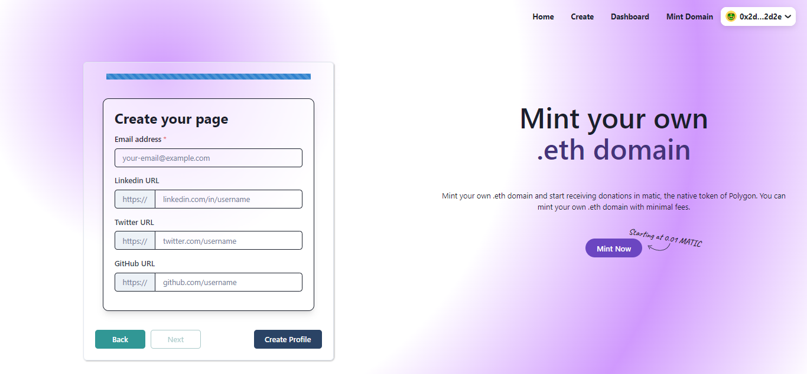
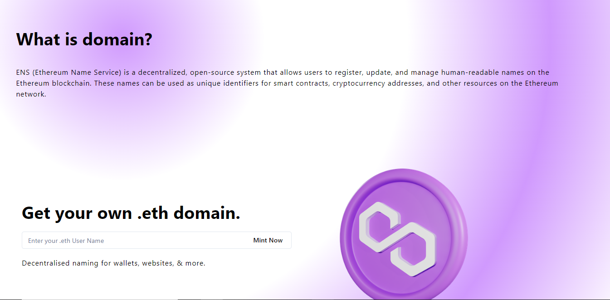

# Buy Me a Matic
Buy-me-a-matic provides utilities to create your personal profile on-chain. Every user can buy their unique ENS from Buy-me-a-matic and use it to create an on-chain profile. Share your on-chain profile with a larger audience and receive MATIC as a donation. This dApp is enhanced with Polygon Network so users will have a seamless transaction experience over the action of sending or receiving MATIC. Feel secure as your data is stored on smart contract and Buy-me-a-matic gets it through your ENS domain.
## Demo


<p float="left">
  




</p>

## Prerequisites

The admin user must have Node.js and npm to use this boilerplate. Just download Node.js from [here](https://nodejs.org/en/download/). Every user must have Metamask wallet to give or receive the donations. Checkout how to create Metamask wallet from [here](https://metamask.io/download/).

## Setup Instructions

Clone the repo via CLI:
```sh
git clone https://github.com/rkmonarch/Buy-me-a-matic
cd Buy-me-a-matic
```

Install the required packages:
```sh
npm install 
yarn install   #or
```

In the project directory, you can run:
```sh
npm run dev
yarn dev   #or
```

- Open [http://localhost:3000](http://localhost:3000) to view it in the browser.
